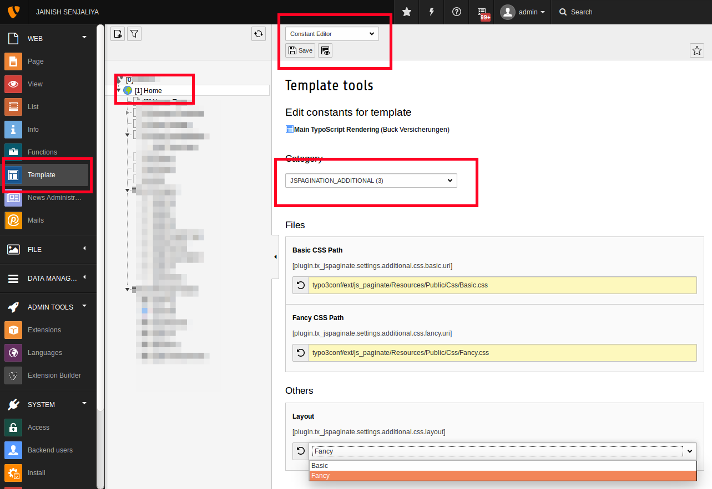

.. ==================================================
.. FOR YOUR INFORMATION
.. --------------------------------------------------
.. -*- coding: utf-8 -*- with BOM.

.. include:: ../Includes.txt

.. _admin-manual:

Administrator Manual
====================

Target group: **Administrators**

Pagination extension provides the pagination for all the custom extension records and as well for bydefault extension like news.

.. _admin-installation:

Installation
------------

To install the extension, perform the following steps:

#. Go to the Extension Manager
#. Install the extension

.. tip::

   Include your static template (from extensions)

.. tip::

   Pagination configuration for Basic and Fancy layout.

   Pagination layout configuration