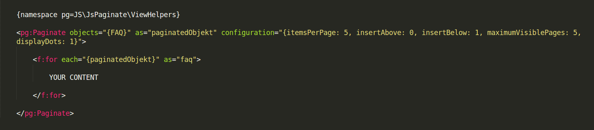

.. ==================================================
.. FOR YOUR INFORMATION
.. --------------------------------------------------
.. -*- coding: utf-8 -*- with BOM.

.. include:: ../Includes.txt

.. _user-manual:

Users Manual
============

Target group: **Editors**

Here should be described how to use the extension from the editor perspective.

.. tip::

   Simple pagination configuration your plugin.

.. First need to add pagination viewhelper in your file. ::

   {namespace pg=JS\JsPaginate\ViewHelpers}

configuration setting
---------------------
Following code need to use when data are in array form.::

	{namespace pg=JS\JsPaginate\ViewHelpers}
	
	<pg:Paginate objects="{FAQ}" as="paginatedObjekt" configuration="{itemsPerPage: 5, insertAbove: 0, insertBelow: 1, maximumVisiblePages: 5, displayDots: 1}">

		<f:for each="{paginatedObjekt}" as="faq">

			YOUR CONTENT

		</f:for>

	</pg:Paginate>

	1) itemsPerPage = 5
		5 records will display on first page

	2) insertAbove = 1
		if insertAbove is true then pagination will display before content 

	3) insertBelow = 1
		if insertAbove is true then pagination will display after content 

	4) maximumVisiblePages = 5
		Maximum Visible Pages 5 in pagination.

	5) displayDots = 1
		if displayDots is true then dot ( ... ) will be display between pagination after we reach more than maximum Visible Pages.

